## Task 2

- Create a new database named website

```SQL
CREATE DATABASE website;
```

<div align=center>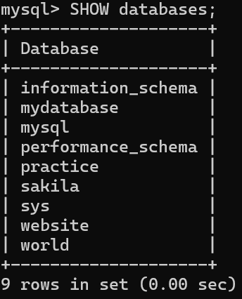</div>

- Create a new table named member, in the website database

```SQL
CREATE TABLE member(
id BIGINT AUTO_INCREMENT,
name VARCHAR(255) NOT NULL,
username VARCHAR(255) NOT NULL,
password VARCHAR(255) NOT NULL,
follower_count INT UNSIGNED NOT NULL DEFAULT 0,
time DATETIME NOT NULL DEFAULT CURRENT_TIMESTAMP,
PRIMARY KEY(id)
);
```

<div align=center>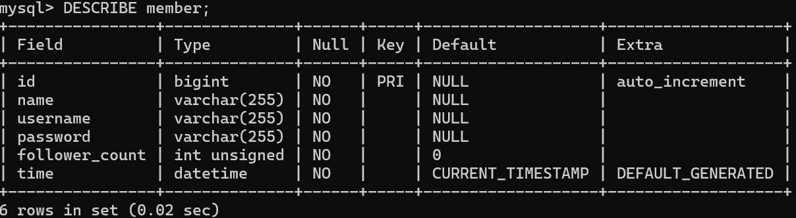</div>

## Task 3

- INSERT a new row to the member table where name, username and password must
  be set to test.

```SQL
INSERT INTO member (name, username, password) values ('test', 'test', 'test');
```

- INSERT additional 4 rows with arbitrary data.

```SQL
INSERT INTO member (name, username, password, follower_count, time) values ('Fred', 'Smith', '123456', 0, now()), ('Sara', 'Watson', '123456', 0, now()),('Will', 'Jackson', '123456', 1, now()),('Paula', 'Johnson', '123456', 0, now())
```

- SELECT all rows from the member table.

```SQL
SELECT * FROM member;
```

<div align=center>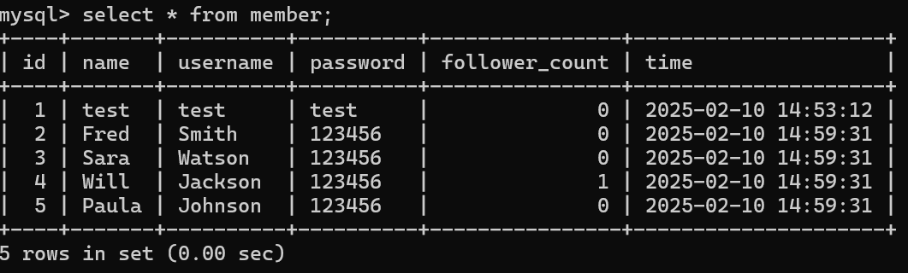</div>

- SELECT all rows from the member table, in descending order of time.

```SQL
SELECT * FROM member ORDER BY time DESC;
```

<div align=center>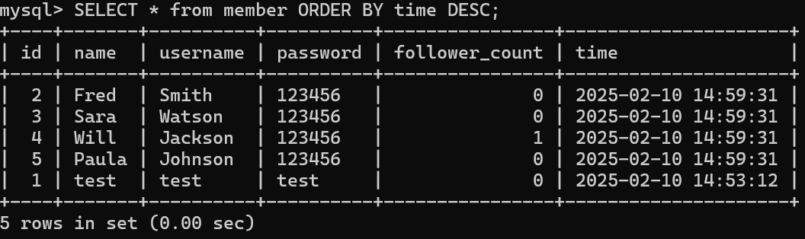</div>

- SELECT total 3 rows, second to fourth, from the member table, in descending order
  of time.

```SQL
SELECT * FROM member
ORDER BY time DESC
LIMIT 3 OFFSET 1;
```

<div align=center>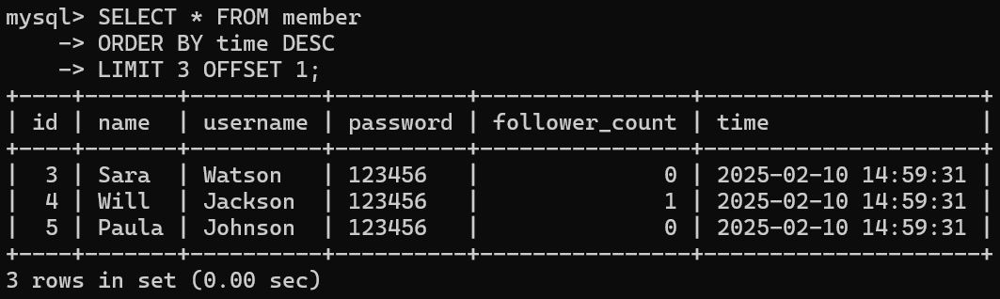</div>

- SELECT rows where username equals to test.

```SQL
SELECT * from member WHERE username = 'test';
```

<div align=center>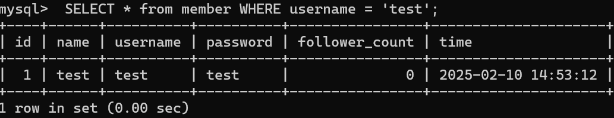</div>

- SELECT rows where name includes the es keyword.

```SQL
SELECT * from member WHERE name LIKE '%es%';
```

<div align=center>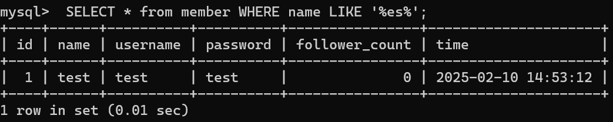</div>

- SELECT rows where both username and password equal to test.

```SQL
SELECT * from member WHERE username = 'test' AND password = 'test';
```

<div align=center>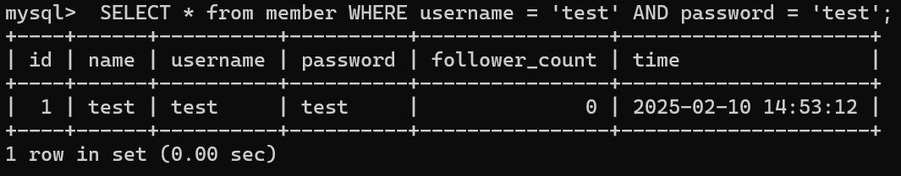</div>

- UPDATE data in name column to test2 where username equals to test.

```SQL
UPDATE member SET name = 'test2' WHERE username = 'test';
```

<div align=center></div>

## Task 4

- SELECT how many rows from the member table.

```SQL
SELECT COUNT(*) FROM member;
```

<div align=center>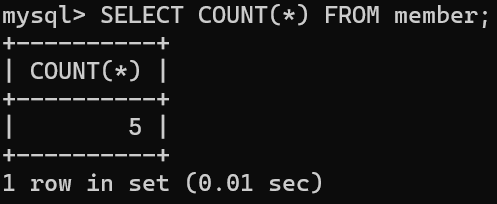</div>

- SELECT the sum of follower_count of all the rows from the member table.

```SQL
SELECT SUM(follower_count) FROM member;
```

<div align=center>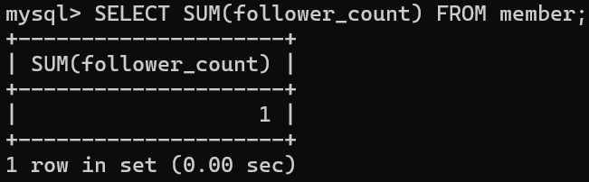</div>

- SELECT the average of follower_count of all the rows from the member table.

```SQL
SELECT AVG(follower_count) FROM member;
```

<div align=center>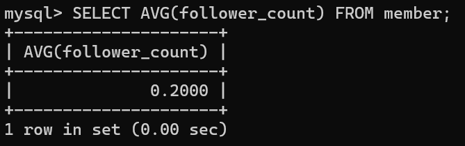</div>

- SELECT the average of follower_count of the first 2 rows, in descending order of
  follower_count, from the member table.

```sql
SELECT AVG(follower_count) FROM (SELECT follower_count FROM member
ORDER BY follower_count DESC
LIMIT 2) AS sub_query;
```

<div align=center>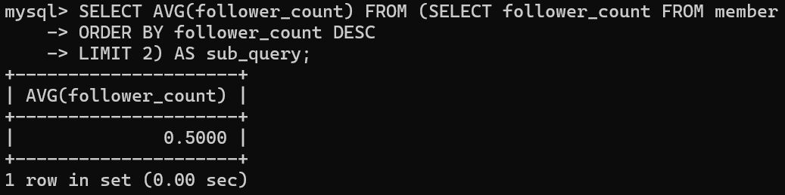</div>

## Task 5

- Create a new table named message, in the website database.

```sql
CREATE TABLE message(
id BIGINT AUTO_INCREMENT,
member_id BIGINT NOT NULL,
content VARCHAR(255) NOT NULL,
like_count INT UNSIGNED NOT NULL DEFAULT 0,
time DATETIME NOT NULL DEFAULT CURRENT_TIMESTAMP,
PRIMARY KEY(id),
FOREIGN KEY(member_id) REFERENCES member(id)
);
```

<div align=center>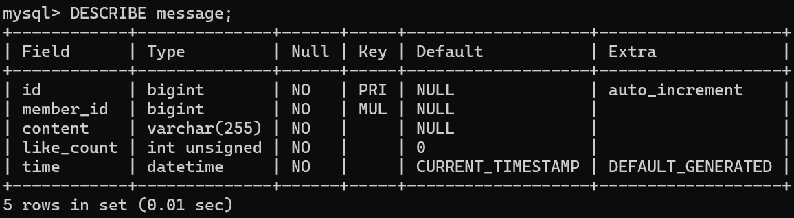</div>

- SELECT all messages, including sender names.

```SQL
SELECT MESSAGE.*, MEMBER.NAME FROM MESSAGE JOIN MEMBER ON MESSAGE.MEMBER_ID = MEMBER.ID;
```

<div align=center>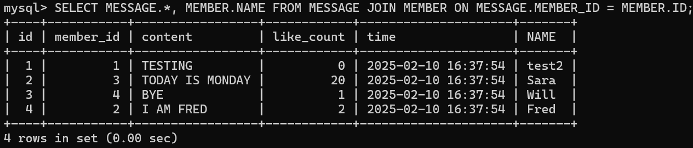</div>

- SELECT all messages, including sender names, where sender username equals to test.

```SQL
SELECT MESSAGE.*, MEMBER.NAME FROM MESSAGE JOIN MEMBER ON MESSAGE.MEMBER_ID = MEMBER.ID WHERE MEMBER.USERNAME = 'test';
```

<div align=center>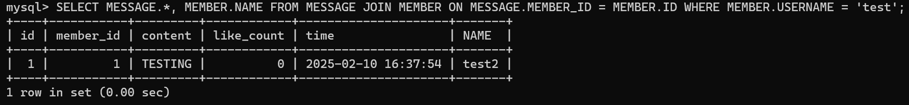</div>

- Use SELECT, SQL Aggregation Functions with JOIN statement, get the average like count of messages where sender username equals to test.

```sql
SELECT MEMBER.USERNAME, AVG(MESSAGE.like_count) FROM MESSAGE JOIN MEMBER ON MESSAGE.MEMBER_ID = MEMBER.ID WHERE MEMBER.USERNAME = 'test';
```

<div align=center>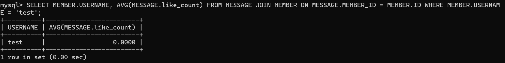</div>

- Use SELECT, SQL Aggregation Functions with JOIN statement, get the average like count of messages GROUP BY sender username.

```SQL
SELECT MEMBER.USERNAME, AVG(MESSAGE.like_count) FROM MESSAGE JOIN MEMBER ON MESSAGE.MEMBER_ID = MEMBER.ID GROUP BY MEMBER.USERNAME;
```

<div align=center>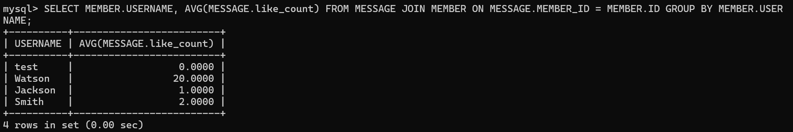</div>
